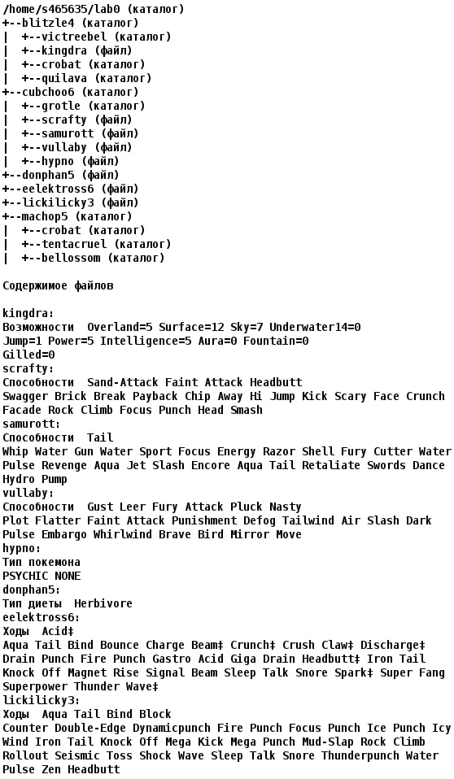

# Лабораторная работа по ОПД №1
## Вариант 11104
## Выполнил Григорьев Даниил Александрович, группа 1.11 (P3116)

### 🂡 &nbsp;&nbsp;&nbsp;&nbsp;&nbsp;&nbsp;&nbsp; [Руководство по Unix-системам](docs/UNIX_commands.md)
### 🂦 &nbsp;&nbsp;&nbsp;&nbsp;&nbsp;&nbsp;&nbsp; [Руководство по Bash](docs/bash.md)
### 🂧 &nbsp;&nbsp;&nbsp;&nbsp;&nbsp;&nbsp;&nbsp; [Руководство по procfs](docs/procfs_UNIX.md)
### 1. Создать приведенное в варианте дерево каталогов и файлов с содержимым. В качестве корня дерева использовать каталог lab0 своего домашнего каталога. Для создания и навигации по дереву использовать команды: mkdir, echo, cat, touch, ls, pwd, cd, more, cp, rm, rmdir, mv.




## 2. Установить согласно заданию права на файлы и каталоги при помощи команды chmod, используя различные способы указания прав.

- blitzle4: права 317
- victreebel: rwx-wxrw-
- kingdra: владелец должен читать файл; группа-владелец должна читать файл; остальные пользователи должны не иметь никаких прав
- crobat: r-x-wxrwx
- quilava: права 307
- cubchoo6: rwxrw-r--
- grotle: rwx-wxrwx
- scrafty: ------rw-
- samurott: права 404
- vullaby: владелец должен читать файл; группа-владелец должна не иметь никаких прав; остальные пользователи должны не иметь никаких прав
- hypno: владелец должен читать файл; группа-владелец должна не иметь никаких прав; остальные пользователи должны читать файл
- donphan5: права 044
- eelektross6: r--------
- lickilicky3: владелец должен читать файл; группа-владелец должна читать файл; остальные пользователи должны не иметь никаких прав
- machop5: права 330
- crobat: rwxrw-r--
- tentacruel: rwx-wx-wx
- bellossom: права 355
## 3. Скопировать часть дерева и создать ссылки внутри дерева согласно заданию при помощи команд cp и ln, а также комманды cat и перенаправления ввода-вывода.

- объеденить содержимое файлов lab0/cubchoo6/hypno, lab0/blitzle4/kingdra, в новый файл lab0/eelektross6_95
- cоздать символическую ссылку для файла eelektross6 с именем lab0/cubchoo6/scraftyeelektross
- скопировать файл eelektross6 в директорию lab0/machop5/bellossom
- скопировать содержимое файла donphan5 в новый файл lab0/cubchoo6/samurottdonphan
- создать символическую ссылку c именем Copy_16 на директорию cubchoo6 в каталоге lab0
- cоздать жесткую ссылку для файла lickilicky3 с именем lab0/cubchoo6/vullabylickilicky
- скопировать рекурсивно директорию blitzle4 в директорию lab0/machop5/bellossom
## 4. Используя команды cat, wc, ls, head, tail, echo, sort, grep выполнить в соответствии с вариантом задания поиск и фильтрацию файлов, каталогов и содержащихся в них данных.

1. Подсчитать количество строк содержимого файлов в директории machop5, отсортировать вывод по увеличению количества, подавить вывод ошибок доступа
2. Вывести список имен файлов в директории blitzle4, список отсортировать по имени z->a, ошибки доступа перенаправить в файл в директории /tmp
3. Вывести содержимое файлов в директории cubchoo6, строки отсортировать по имени a->z, ошибки доступа перенаправить в файл в директории /tmp
4. Вывести рекурсивно список имен файлов в директории blitzle4, список отсортировать по имени a->z, ошибки доступа не подавлять и не перенаправлять
5. Рекурсивно вывести содержимое файлов из директории lab0, имя которых начинается на 'c', строки отсортировать по имени a->z, добавить вывод ошибок доступа в стандартный поток вывода
6. Вывести четыре последних элемента рекурсивного списка имен и атрибутов файлов в директории lab0, содержащих строку "li", список отсортировать по убыванию количества жестких ссылок, добавить вывод ошибок доступа в стандартный поток вывода
## 5. Выполнить удаление файлов и каталогов при помощи команд rm и rmdir согласно варианту задания.

- Удалить файл eelektross6
- Удалить файл lab0/blitzle4/kingdra
- удалить символические ссылки lab0/cubchoo6/scraftyeelektro*
- удалить жесткие ссылки lab0/cubchoo6/vullabylickilic*
- Удалить директорию blitzle4
- Удалить директорию lab0/blitzle4/quilava

```bash
#!/bin/sh

# 1 task
mkdir lab0
cd lab0
mkdir blitzle4
mkdir cubchoo6
touch donphan5
touch eelektross6
touch lickilicky3
mkdir machop5
cd blitzle4
mkdir victreebel
touch kingdra
mkdir crobat
mkdir quilava
cd ..
cd cubchoo6
mkdir grotle
touch scrafty
touch samurott
touch vullaby
touch hypno
cd ..
cd machop5
mkdir crobat
mkdir tentacruel
mkdir bellossom
cd ..
cd blitzle4
echo -e "Возможности Overland=5 Surface=12 Sky=7 Underwater14=0\nJump=1 Power=5 Intelligence=5 Aura=0 Fountain=0 Gilled=0" >> kingdra
cd ..
cd cubchoo6
echo -e "Способности Sand-Attack Faint Attack Headbutt\nSwagger Brick Break Payback Chip Away Hi Jump Kick Scary Face Crunch\nFacade Rock Climb Focus Punch Head Smash" >> scrafty
echo -e "Способности Tail\nWhip Water Gun Water Sport Focus Energy Razor Shell Fury Cutter Water\nPulse Revenge Aqua Jet Slash Encore Aqua Tail Retaliate Swords Dance Hydro\nPump" >> samurott
echo -e "Способности Gust Leer Fury Attack Pluck Nasty\nPlot Flatter Faint Attack Punishment Defog Tailwind Air Slash Dark\nPulse Embargo Whirlwind Brave Bird Mirror Move" >> vullaby
echo -e "Тип покемона\nPSYCHIC NONE" >> hypno
cd ..
echo "Тип диеты Herbivore" >> donphan5
echo -e "Ходы Acid\nAqua Tail Bind Bounce Charge Beam Crunch Crush Claw Discharge Drain Punch Fire Punch Gastro Acid Giga Drain Headbutt Iron Tail Knock Off Magnet Rise Signal Beam Sleep Talk Snore Spark Super Fang\nSuperpower Thunder Wave" >> eelektross6
echo -e "Ходы Aqua Tail Bind Block\nCounter Double-Edge Dynamicpunch Fire Punch Focus Punch Ice Punch Icy\nWind Iron Tail Knock Off Mega Kick Mega punch Mud-Slap Rock Climb\nRollout Seismic Toss Shock Wave Sleep Talk Snore Thunderpunch Water\nPulse Zen Headbutt" >> lickilicky3

# 2 task
chmod 317 blitzle4
chmod u=rwx,g=wx,o=rw ./blitzle4/victreebel
chmod u=r,g=r ./blitzle4/victreebel
chmod u=rx,g=wx,o=rwx machop5/crobat
chmod 307 blitzle4/quilava
chmod u=rwx,g=rw,o=r ./cubchoo6/
chmod u=rwx,g=wx,o=rwx ./cubchoo6/grotle
chmod o=rw ./cubchoo6/scrafty
chmod 404 ./cubchoo6/samurott
chmod u=r ./cubchoo6/vullaby
chmod u=r,o=r ./cubchoo6/hypno
chmod 044 donphan5
chmod u=r eelektross6 
chmod u=r,g=r lickilicky3 
chmod 330 machop5/
chmod u=rwx,g=rw,o=r ./machop5/crobat
chmod u=rwx,g=wx,o=wx ./machop5/tentacruel
chmod 355 ./machop5/bellossom

# 3 task
cat cubchoo6/hypno blitzle4/kingdra > eelektross6_95
ln -s eelektross6_95 cubchoo6/scraftyeelektross
cp eelektross6 machop5/bellossom
sudo cat donphan5 > cubchoo6/samurottdomphan
ln -s cubchoo6/ Copy_16
ln lickilicky3 cubchoo6/vullabylicklicky
sudo cp -r blitzle4/ machop5/bellossom

# 4 task

# 1 ex:
find . -type f -exec wc -l {} + 2>/dev/null | sort -n

# 2 ex:
sudo ls blitzle4/ | sort -r | 2>/tmp/file.txt

# 3 ex:
sudo ls blitzle4/ | sort -r | 2>tmp/file.txt

# 4 ex:
ls -r1 | sort

# 5 ex
grep . -r --include="\c*" ./ | sort | 2>&1

# 6 ex
ls -lR | grep "li"| sort -k 2 -r | tail -n 4 | 2>&1 cat

# 5 task
rm eelektross6
rm ./blitzle4/kingdra
rm cubchoo6/scraftyeelektro*
rm cubchoo6/vullabylickilic*
rm -r blitzle4
rm blitzle4/quilava
```

## Дополнительное задание для закрепления знаний:
### - написать утилиту на bash для получения данных о запущенных процессах из procfs (что это?)
### + необходимо получать данные: 
1. название запущенной утилиты, 
2. открытые файловые дескрипторы, 
3. pid дочерних процессов;
4. * рекурсивные такие же выводы для каждого дочернего процесса. 
### + утилита должна иметь возможность указать аргумент – номер pid, информацию для которого хотим посмотреть.
### + запускаться команда должна из командной строки как `./script-name target-pid-arg`
### ? потребуется разобраться с переменными, циклами и условиями в bash, а так же с органицацией procfs
### * продемонстрировать работу этой утилиты в каком-то контейнере Docker, где запускается какое-то приложение с учебной лабой

# Примерное решение:
😀😁😏🙄😦🙂😌😭😘😡😝😝🤯😖☹️🙃😍😳😜🧐🤓
## 1. Что такое procfs?
### Procfs (или файловая система процессов) — это виртуальная файловая система в Linux, которая предоставляет информацию о процессах и других системных ресурсах. Все процессы представляются в виде директорий, именованных по их идентификаторам (PID). Например, информация о процессе с PID 123 будет находиться в /proc/123.

## 2. Структура утилиты
## Мы создадим скрипт, который будет:

- Принимать PID процесса в качестве аргумента.
- Извлекать информацию о процессе:
- Название утилиты
- Открытые файловые дескрипторы
- PID дочерних процессов
- Рекурсивно повторять для каждого дочернего процесса.
## 3. Код скрипта
### Вот пример реализации:

```bash
#!/bin/bash
```

### Функция для получения информации о процессе
```bash
get_process_info() {
    local pid=$1

    # Проверка, существует ли процесс
    if [ ! -d "/proc/$pid" ]; then
        echo "Процесс с PID $pid не найден."
        return
    fi

    # Название утилиты
    local cmdline=$(cat /proc/$pid/cmdline | tr '\0' ' ')
    echo "Утилита: $cmdline"

    # Открытые файловые дескрипторы
    echo "Открытые файловые дескрипторы:"
    ls -l /proc/$pid/fd | awk '{print $9}'

    # PID дочерних процессов
    echo "Дочерние процессы:"
    local children=$(pgrep -P $pid)
    if [ -z "$children" ]; then
        echo "Нет дочерних процессов."
    else
        for child in $children; do
            echo "- PID: $child"
            get_process_info $child  # Рекурсивный вызов для дочернего процесса
        done
    fi
}

# Проверка аргумента
if [ -z "$1" ]; then
    echo "Использование: $0 target-pid-arg"
    exit 1
fi
```
### Получение информации о процессе
```bash
get_process_info $1
```
## 4. Запуск скрипта
### Сохраните скрипт в файл, например, ```process_info.sh.```


### Сделайте его исполняемым:
```bash
chmod +x process_info.sh
```
### Запустите его с PID процесса, информацию о котором хотите получить:

```bash
./process_info.sh <target-pid>
```
## 5. Пример работы в Docker
### Чтобы продемонстрировать работу утилиты в Docker, можно создать простой контейнер с приложением. Например, можно использовать образ alpine и установить в него bash:

### Создайте Dockerfile:
```bash
Dockerfile
Копировать код
FROM alpine:latest

RUN apk add --no-cache bash
COPY process_info.sh /usr/local/bin/process_info.sh
RUN chmod +x /usr/local/bin/process_info.sh

CMD ["sh"]
Соберите образ:

bash
Копировать код
docker build -t process-info .
Запустите контейнер:

bash
Копировать код
docker run -it --privileged process-info
Внутри контейнера запустите любое приложение (например, sleep):

bash
Копировать код
sleep 100 &
Получите его PID, а затем используйте утилиту:
```
```bash
./process_info.sh <pid>
```
### Этот скрипт на Bash позволяет получить полезную информацию о процессах и их дочерних процессах, используя данные из /proc.
