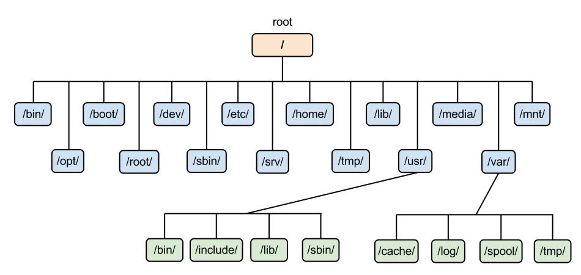

# Команды терминала Unix-систем
###  &nbsp;&nbsp;&nbsp;&nbsp;[Ответы на вопросы](answers.md)
### &nbsp;&nbsp;&nbsp;&nbsp;&nbsp;[Документация по Bash](bash.md)
## Работа с файлами и директориями
### ➤ ls - вывести информацию о файлах и директориях:
+ `-C` напечатать список файлов в колонках с вертикальной сортировкой
+ `-R` включить рекурсивную выдачу списка каталогов
+ `-a` включать в список файлы с именем, начинающимся с `.`
+ `-d` выдавать имена каталогов, будто они обычные файлы, вместо того, чтобы показывать их содержимое
+ `-i` выводить для каждого файла его серийный номер (номер inode)
+ `-l` выдавать в одноколоночном формате тип файла, права доступа к файлу, количество ссылок на файл, имя владельца, имя группы, размер файла (в байтах), временной штамп и имя файла. Типы файлов могут принимать такие значения: `-` для обычного файла, `d` для каталога, `l` - для символьной ссылки
+ `-r` производить сортировку в обратном порядке
+ `-t` сортировать по временному штампу
+ `-S` сортировать по размеру
+ `-X` сортировать по расширению
+ `-k*` сортировать по столбцу под номером `*`
### ➤ cp - копирование файлов или директорий:
+ `-R` - рекурсивное копирование каталогов
+ `-i` - запрос подтверждения при перезаписи
### ➤ mv - перемещение или переименование файлов:
### ➤ rm - удаление файлов и директорий:
+ `-r` - рекурсивное удаление
+ `-f` - принудительное удаление
### ➤ rmdir - удаление директории
### ➤ cat - вывод содержимого/перенаправление в файл:
+ `-b` - нумерует все непустые строки выходного файла
### ➤ mkdir - создание директории
### ➤ touch - создает пустой файл или обновляет временную метку существующего файла
### ➤ pwd - выводит текущий рабочий каталог
### ➤ cd - перемещение по директориям
### ➤ more - постраничный просмотр текста
### ➤ mv - перемещает или переименовывает файл или каталог
### ➤ chmod - изменяет права доступа к файлу или каталогу
#### user/group/other
### ➤ wc - подсчитывает количество строк, слов и символов в файле
### ➤ head - выводит первые строки файла
### ➤ tail - выводит последние строки файла
### ➤ echo - выводит строку текста или записывает в файл
#### > - записать текст в файл (перезапись), >> - добавить текст в файл (перезапись не выполняется)
### ➤ sort - сортирует строки:
+ `-r` - сортировать в обратном порядке
+ `-n` - сортировать как числа (по умолчанию сортировка строковая)
+ `-k` сортировать по указанному столбцу
+ `-t` указать разделитель столбцов (по умолчанию пробел или табуляция)
+ `-u` - удалить дублирующиеся строки (оставить только уникальные)
+ `-o` - сохранить результат в файл
+ `-f` - игнорировать регистр букв
### ➤ grep - ищет строки, соответствующие шаблону
+ `-i` - игнорировать регистр при поиске
+ `-v` - вывести строки, не соответствующие шаблону
+ `-c` - подсчитать количество строк, соответствующих шаблону
+ `-n` - вывести строки с номерами
+ `-l` - показать только имена файлов, содержащих совпадения
+ `-L` - показать только имена файлов, не содержащих совпадения
+ `-w` - ищет только целые слова
+ `-x` - ищет строки, полностью совпадающие с шаблоном
+ `-r` - поиск в директории и во всех ее поддиректориях
+ `-E` - использование расширенных регулярных выражений

# Иерархия файловой системы Unix-систем:

> + / — root каталог. Содержит в себе всю иерархию системы;
> + /bin — здесь находятся двоичные исполняемые файлы. Основные общие команды, хранящиеся отдельно от других программ в системе (прим.: pwd, ls, cat, ps);
> + /boot — тут расположены файлы, используемые для загрузки системы (образ initrd, ядро vmlinuz);
>+ /dev — в данной директории располагаются файлы устройств (драйверов). С помощью этих файлов можно взаимодействовать с устройствами. К примеру, если это жесткий диск, можно подключить его к файловой системе. В файл принтера же можно написать напрямую и отправить задание на печать;
>+ /etc — в этой директории находятся файлы конфигураций программ. Эти файлы позволяют настраивать системы, сервисы, скрипты системных демонов;
>+ /home — каталог, аналогичный каталогу Users в Windows. Содержит домашние каталоги учетных записей пользователей (кроме root). При создании нового пользователя здесь создается одноименный каталог с аналогичным именем и хранит личные файлы этого пользователя;
>+ /lib — содержит системные библиотеки, с которыми работают программы и модули ядра;
>+ /lost+found — содержит файлы, восстановленные после сбоя работы системы. Система проведет проверку после сбоя и найденные файлы можно будет посмотреть в данном каталоге;
>+ /media — точка монтирования внешних носителей. Например, когда вы вставляете диск в дисковод, он будет автоматически смонтирован в директорию /media/cdrom;
>+ /mnt — точка временного монтирования. Файловые системы подключаемых устройств обычно монтируются в этот каталог для временного использования;
>+ /opt — тут расположены дополнительные (необязательные) приложения. Такие программы обычно не подчиняются принятой иерархии и хранят свои файлы в одном подкаталоге (бинарные, библиотеки, конфигурации);
>+ /proc — содержит файлы, хранящие информацию о запущенных процессах и о состоянии ядра ОС;
>+ /root — директория, которая содержит файлы и личные настройки суперпользователя;
>+ /run — содержит файлы состояния приложений. Например, PID-файлы или UNIX-сокеты;
>+ /sbin — аналогично /bin содержит бинарные файлы. Утилиты нужны для настройки и администрирования системы суперпользователем;
>+ /srv — содержит файлы сервисов, предоставляемых сервером (прим. FTP или Apache HTTP);
>+ /sys — содержит данные непосредственно о системе. Тут можно узнать информацию о ядре, драйверах и устройствах;
>+ /tmp — содержит временные файлы. Данные файлы доступны всем пользователям на чтение и запись. Стоит отметить, что данный каталог очищается при перезагрузке;
>+ /usr — содержит пользовательские приложения и утилиты второго уровня, используемые пользователями, а не системой. Содержимое доступно только для чтения (кроме root). Каталог имеет вторичную иерархию и похож на корневой;
>+ /var — содержит переменные файлы. Имеет подкаталоги, отвечающие за отдельные переменные. Например, логи будут храниться в /var/log, кэш в /var/cache, очереди заданий в /var/spool/ и так далее.

# Символические и жесткие ссылки
Жесткие ссылки ссылаются на inode файла или директории, поэтому при удалении файла\директории ссылка продолжает работать. Ячейка inode очищается только, когда удален оригинальный файл\директория и все жесткие ссылки
Символические ссылки ссылаются на сам файл, поэтому при удалении ориг файла\директории перестает работать
# Перенаправление потоков
Какие есть потоки: stdin(0), stdout(1), stderr(2)
> + \> file - перенаправить stdout в file
> + \>\> file - добавить stdout к file
> + 2\> file - перенаправить stderr в file
> + 2\>\> file - добавить stderr к file
> + \< file - взять stdin из file
> + \<\< EOF - записать в stdin из терминала до символов "EOF"
> + ls | sort - перенаправить stdout команды ls на stdin команды sort
> 0 \> dev/null -  перенаправить stdin в "пустоту"
# Регулярные выражения
+ Символ - соответствует сам себе
+ ^ - начало строки
+ $ - конец строки
+ . - один любой символ

